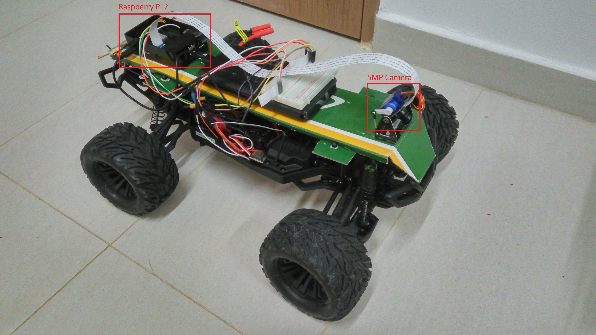
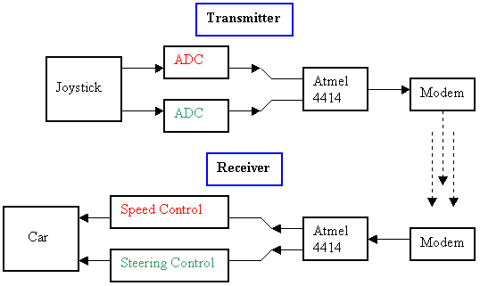
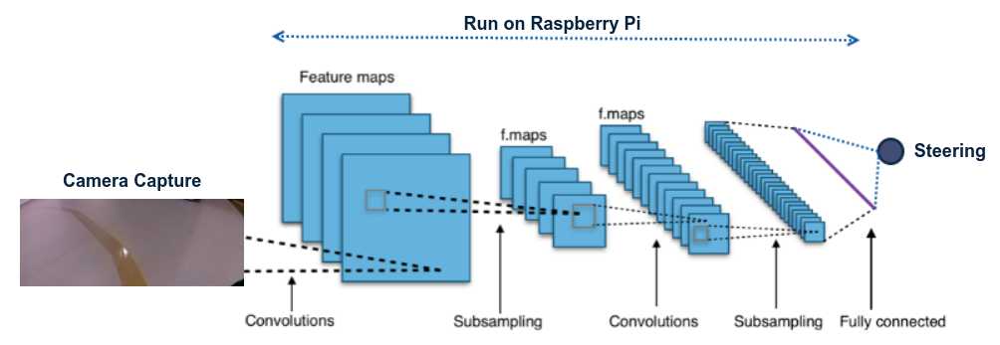

# Objective

To make a lane follower based on a standard RC car using Raspberry Pi and a camera. The software is a simple Convolutional Network, which takes in the image fetched from the camera and outputs the steering angle.

# Design

## Hardware

The receiver of a standard RC car receives throttle and steering signals from the transmitter. The signals are converted to PWM pulses by the receiver to directly control the speed of the motor and the steering angle of the servo. The following figure pictures the wiring of a standard RC car:

During data collection, we will simply hook the steering PWM of the car to pin GPIO17. The script **raspberry_pi/collect_data.py** will record the values of steering PWM and the associated images. The data of each trial are collectively stored in driving\_trial_*. The trial folders are automatically numbered.

## Software

In autonomous mode, the servo of the car is connected to pin GPIO18 of Raspberry Pi instead of the receiver. The Raspberry Pi will use the camera to capture the image and use the trained neural network to predict the steering angle. The steering angle is then translated to PWM signal to control the servo. This whole processing pipeline is implemented in the script **raspberry_pi/drive_me.py**.

# About

* rasp_pi/ - scripts to run on the Raspberry Pi to collect data as well as to automatically control the car.
    * collect_data.py - the script to capture camera image and record steering PWM signal (need to run "sudo pigpiod" first).
    * drive_me.py - the script to construct the convolutional network, load the weights and control the car.
    * read_PWM.py - helper script to assist in measuring PWM signal.
* network/ - code to train the network
    * Learn to Drive.ipynb - the notebook which shows how to build and train the network.
    * drive\_trial_* - the collected data (images and steerings)
    * weights.hdf5 - pretrained weights

# How to collect data for training

1. Copy files in folder raspberry_pi to the home directory of Raspberry Pi.

2. Run "sudo pigpiod" to start the daemon that manages GPIO pins

3. Run "sudo python collect_data.py" to start collecting data (images and steerings). The script will capture the images and the steering angles to folder drive\_trial_*. The trial folders are automatically numbered.

4. Copy the collected data in drive\_trial_* from Raspberry Pi to the machine used to train the Convolutional Network.

5. Follow the instructions in the "Learn to Drive.ipynb" to train the Convolutional Network. The trained weights will be saved to file weights.hdf5.

# How to use the trained network

1. Copy the trained weights (file weights.hdf5) from the training machine to Raspberry Pi.

2. Run "sudo python drive_me.py" to let the car drive by itself.
